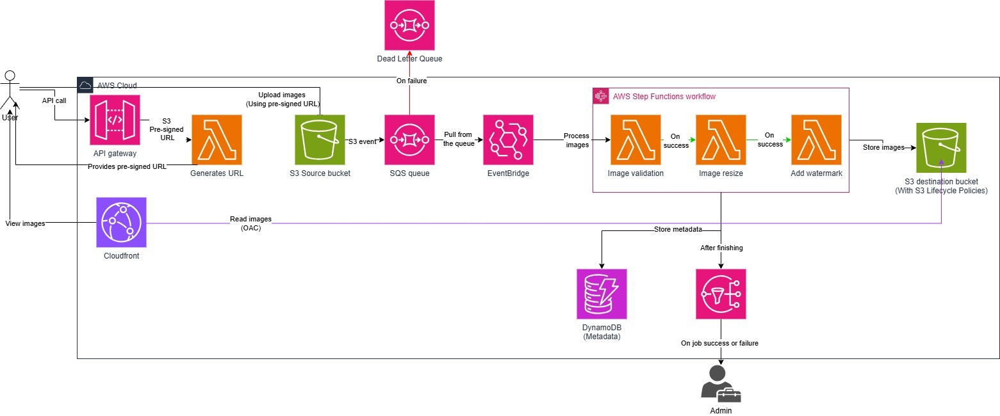

# AWS-manara-project
This project implements a highly resilient, event-driven serverless image processing pipeline on AWS, for a Manara-tech project.

# Serverless Image Processing Pipeline on AWS

An event-driven, fully serverless architecture designed to securely upload, process (validate, resize, watermark), and distribute high-resolution images at scale.

## 🏗 Architecture Overview

This pipeline leverages AWS serverless technologies to ensure high availability, fault tolerance, and cost efficiency. Heavy payloads are offloaded directly to S3 via pre-signed URLs, ingestion is decoupled via SQS, and processing is orchestrated natively using AWS Step Functions.

## 🚀 Execution Flow

1. **Request Upload URL:** The user makes an API call to API Gateway. A Lambda function generates an S3 Pre-signed URL and returns it to the client.
2. **Direct Upload:** The user uploads the image directly to the **S3 Source Bucket** using the Pre-signed URL.
3. **Event Generation:** S3 triggers an event notification to an **SQS Queue**.
4. **Polling & Triggering:** **EventBridge Pipes** polls the SQS queue and starts the **Step Functions** workflow upon receiving a message. (Failures route to a Dead Letter Queue).
5. **Orchestration (Step Functions):**
   - **Validation Lambda:** Confirms file format and integrity.
   - **Resize Lambda:** Resizes the image (using Lambda Layers for binaries like Pillow/Sharp).
   - **Watermark Lambda:** Applies a visual watermark.
7. **Storage & Delivery:** The processed image is saved to the **S3 Destination Bucket**. 
8. **Metadata & Alerts:** Step Functions uses *Direct Service Integrations* to write metadata to **DynamoDB** and publish job status (success/failure) to **SNS**.
9. **Global CDN:** Users view the images via **CloudFront**, which securely accesses the private destination bucket using Origin Access Control (OAC).

## 🧩 Key Components & Justifications

* **API Gateway + Pre-signed URLs:** Bypasses API Gateway's strict 10MB payload limit, saving compute costs and allowing large file uploads directly to S3.
* **SQS + DLQ:** Decouples ingestion from processing. Protects backend compute from traffic spikes and isolates "poison pill" messages (corrupted files) into the DLQ.
* **EventBridge Pipes:** Acts as the native glue to poll SQS and trigger Step Functions without needing custom Lambda polling code.
* **AWS Step Functions:** Orchestrates the multi-step processing logic. Isolates failures, manages retries, and uses Direct Integrations (DynamoDB/SNS) to eliminate unnecessary Lambda invocations.
* **AWS Lambda & Layers:** Provides single-responsibility compute. Layers are used to package heavy image manipulation libraries, keeping deployment packages lightweight.
* **Amazon CloudFront (OAC):** Serves final assets globally with low latency while strictly enforcing that the S3 Destination bucket remains completely private.

## 🛠 Setup & Deployment

1. **Deploy S3 Buckets:** Create the Source and Destination buckets. Enable Event Notifications on the Source bucket and apply Lifecycle Rules to the Destination bucket.
2. **Configure SQS & EventBridge:** Set up the main queue, the DLQ, and configure an EventBridge Pipe to route messages to Step Functions.
3. **Package Lambdas:** Create Lambda Layers for your image processing libraries (e.g., Python Pillow) and deploy the Validation, Resize, and Watermark functions.
4. **Build State Machine:** Define the Step Functions workflow in ASL (Amazon States Language), ensuring you configure `Catch` blocks for errors and use Direct Integrations for DynamoDB (`dynamodb:PutItem`) and SNS (`sns:Publish`).
5. **Setup CloudFront:** Create a CloudFront distribution pointing to the Destination Bucket. Enable OAC and update the S3 bucket policy to allow `cloudfront.amazonaws.com` read access.
